# Team Yod

## PantryRaider
### Spring 2020

### Overview
PantryRaider is a comprehensive tool designed for the UMass Student Food Pantry in Amherst, MA. Prior to this project, the pantry was struggling to effectively communicate and manage daily operations efficiently. The project provides the pantry with a much needed way to manage communications internally and externally, and improve the pantry's daily functioning. Though some aspects of the project have an existing solution, there is no platform that offers all of the feautures needed by the Umass Student Food Pantry in one system. This project offers a simple  and easy to use platform tailored specifically for the UMass Student Food Pantry's goals and needs that was not available beforehand.

The application provides the public with crucial information about the food pantry, and gives admins and volunteers a way to manage pantry operations.  Visitors to the site will be able to view and search through the pantry inventory, find information about how they can help, and register to become a volunteer. Once registered, volunteers will have access to updating the pantry inventory, shift scheduling, tracking various statistics, and internal messages. Pantry admins will also be able to manage registered volunteers and modifying schedules.

### Team Members
- Paulaine Goldsmith ([pkg250](http://github.com/pkg250))
- Lillian Grassin-Drake ([lilgrassin](http://github.com/lilgrassin))

### User Interface

| Page |  View | Description |
| ------------- | -------------------- | ------------- |
| Home | 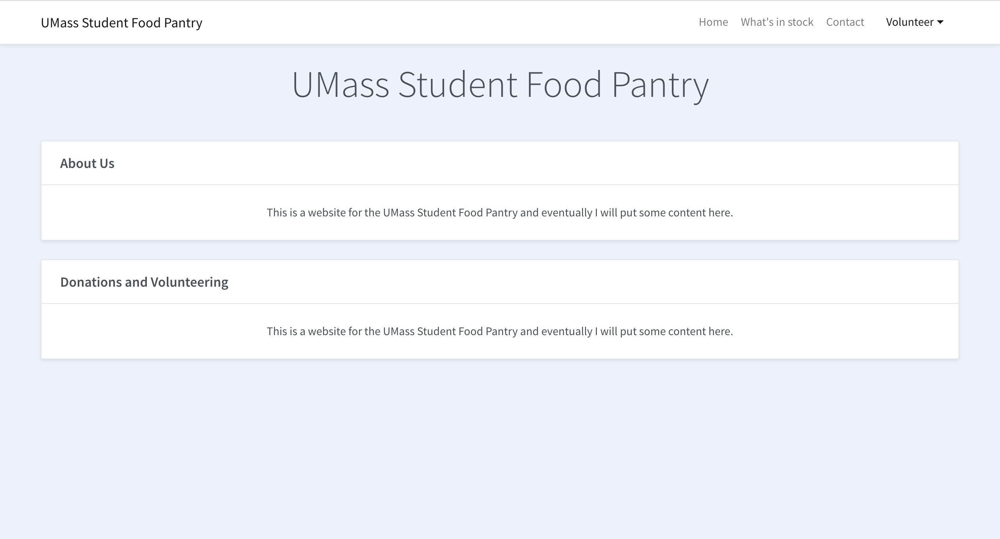 | The landing page of the site that provides information about the pantry and how to donate or volunteer. |
| Inventory  | 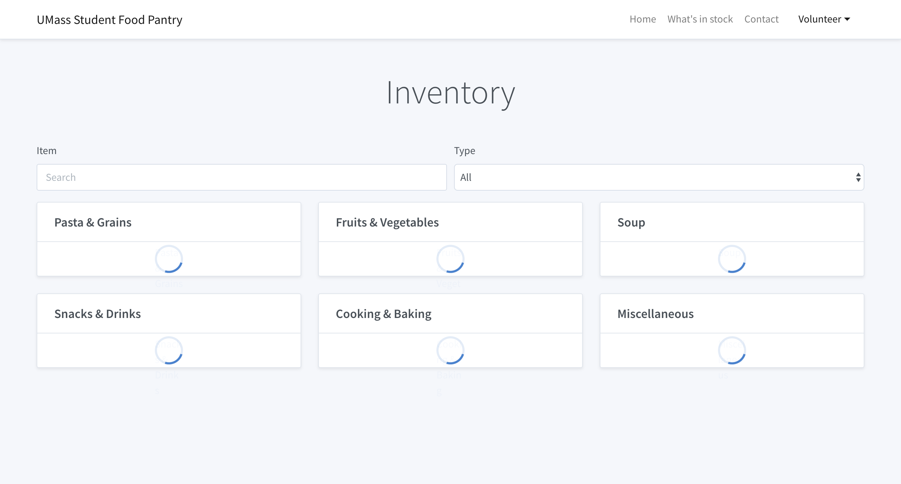  | Allows site visitrs to view the current pantry inventory and serach for a specific item or category of item. |
| Contact  | 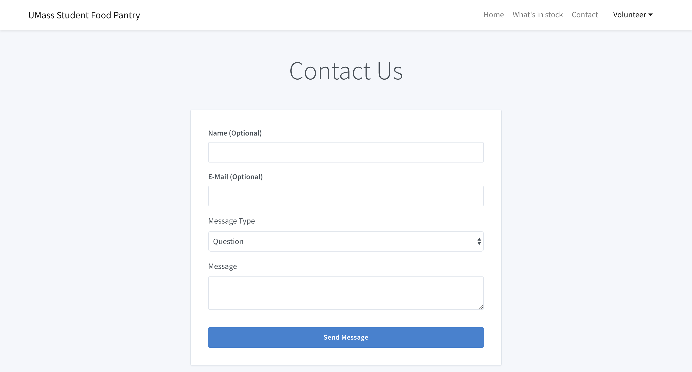  | Allows site visitors to contact the pantry staff with a question, feedback, or item request. |
| Register  |   | Allows a site visitor to register as a new volunteer. |
| Training  | 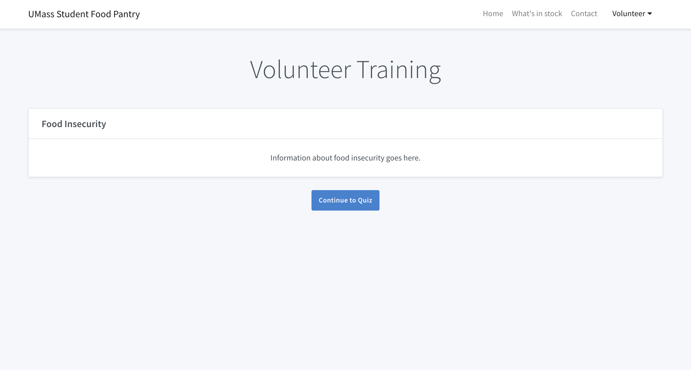  | Provides information about volunteering during the registration process. |
| Training Quiz  |   | A quiz on pantry training information for new volunteers during the registration process. |
| Log In  | 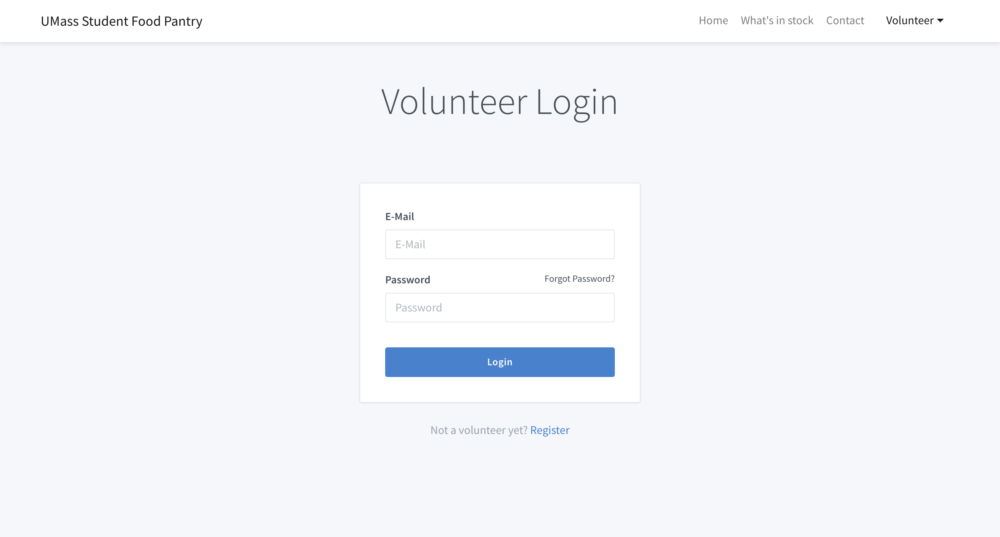  | Allows registered users to log in to the volunteer system. |
| Dashboard  | 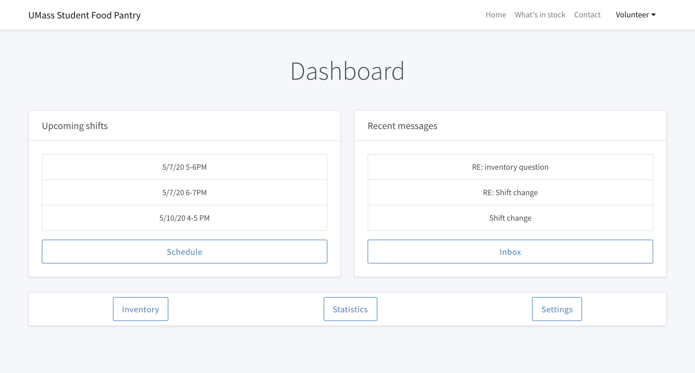  | Displays a volunteer's upcoming shifts and recent messages. |
| Scheduling  | 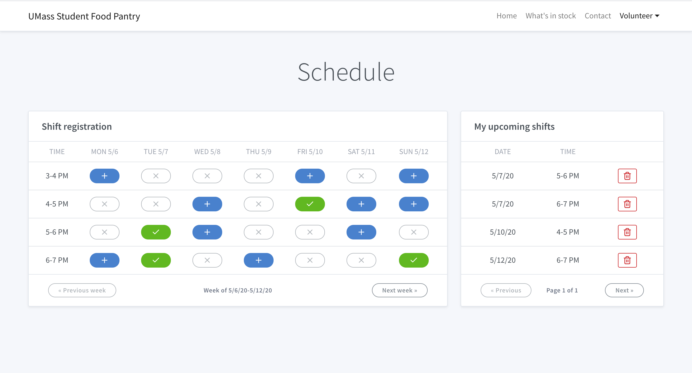  | Allow volunteers to view the weekly schedule, sign up for shifts, or edit existing shifts. |
| Inbox  | 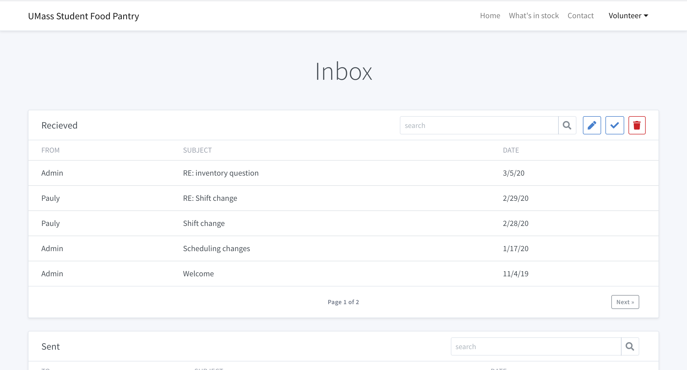  | Displays a volunteer's recent messages and alllows them to compose a new message or delete an old message. |
| Inventory Management  | 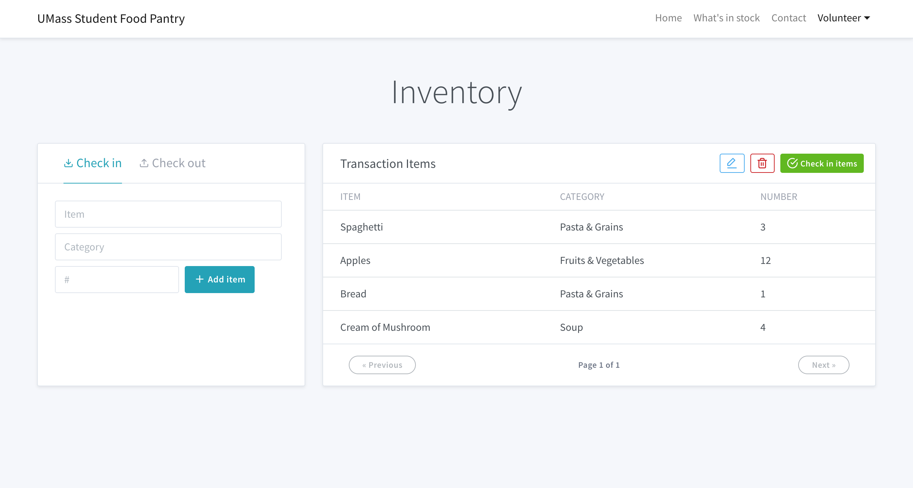  | Allows volunteers to log incoming or outgoing food by searching for items or creating a new item if no match is found. |
| Statistics  | 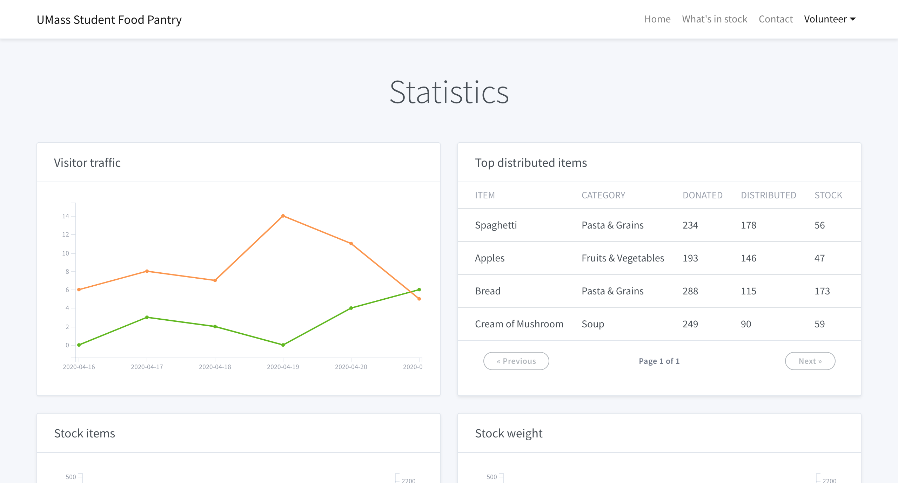  | Display tracked statistics about pantry stock and traffic to volunteers. |
| Profile Settings  | 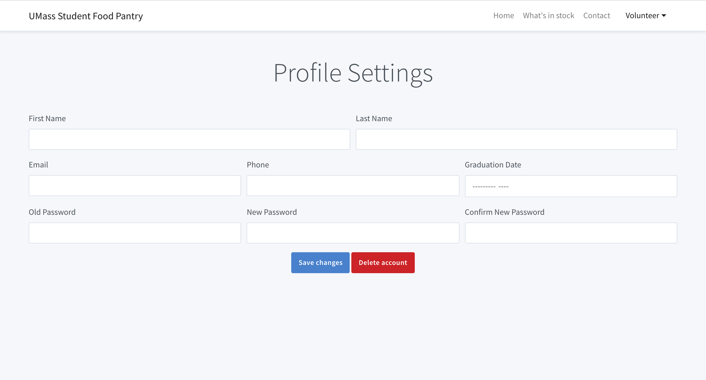  | Allows a volunteer to update their profile information. |
| Administration  | 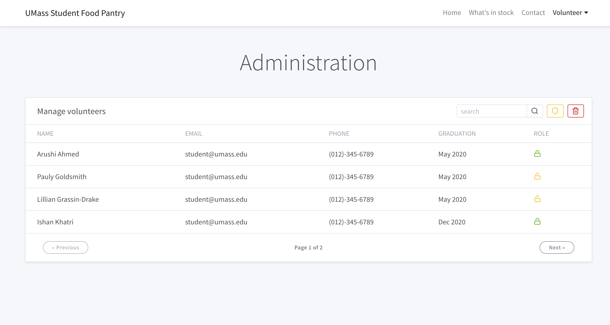  | Admins can view a list of registered volunteers, updates user permissions, and delete inactive volunteers. |

### APIs

#### Users

**Overview:** The Users API allows for the creation of users, updating a user's profile, and displaying a list of users.

| **Parameter** | **Description** | **Example** |
|-----------|-----------------------------------------------|---------------------------------------|
| First Name     | User's first name |{"firstName":"John"} |
| Last Name     | User's last name |{"lastName":"Smith"} |
| E-Mail     | User's e-mail |{"email":"jsmith@umass.edu"} |
| Phone Number     | User's phone number |{"phone":"123-456-7890"} |
| Graduation    | User's graduation semester |{"graduation":"Spring 2020"} |
| Password    | User's password |{"password":"************"} |

#### Messages

**Overview:** The Messages API allows for the creation of new mail, editing of drafted mail, deleting mail from a user's inbox, and displaying a list of a user's mail.

| **Parameter** | **Description** | **Example** |
|-----------|-----------------------------------------------|---------------------------------------|
| From (Name)     | Sender's name |{"fromName":"John Smith"} |
| From (E-Mail)    | Sender's e-mail |{"toEmail":"johnsmith@umass.edu"} |
| To (Name)    | Recipient's name |{"toName":"Jane Smith"} |
| To (E-Mail)     | Recipient's e-mail |{"email":"janesmith@umass.edu"} |
| Subject    | Message type or subject |{"subject":"Question"} |
| Message    | Message content |{"message":"Message content."} |

#### Inventory

**Overview:** The Inventory API allows for displaying a list of items in the inventory.

| **Parameter** | **Description** | **Example** |
|-----------|-----------------------------------------------|---------------------------------------|
| Item     | Pantry inventory item |{"item":"Spaghetti"} |
| Stock    | Number of item in inventory |{"stock":"30"} |
| Type    | Item type |{"type":"Pasta & Grains"} |

#### Transactions

**Overview:** The Transactions API allows for the creation of new items and updating the stock of items.

| **Parameter** | **Description** | **Example** |
|-----------|-----------------------------------------------|---------------------------------------|
| Date    | Date and time of transaction |{"date":"YYYY-MM-DDTHH:mm:ss:sssZ"} |
| User E-Mail   | E-Mail of user that performed transaction |{"userEmail":"jsmith@umass.edu"} |
| Type    | Transaction type |{"type":"check-in"} |
| Items    | List of items included in transaction |{"items":"[{item1}, {item2}]"} |
| Weight    | Total weight of transaction (pounds) |{"weight":"7.6"} |

### Shifts

**Overview:** The Shifts API allows for the creation of new volunteer shifts, updating existing shifts, deleting existing shifts, and displaying a list of a user's shifts.

#### Parameters

| **Parameter** | **Description** | **Example** |
|-----------|-----------------------------------------------|---------------------------------------|
| Date    | Date and time of transaction |{"date":"YYYY-MM-DDTHH:mm:ss:sssZ"} |
| Volunteer  | User profiles of shift volunteer(s) |{"volunteer":"[{user1}, {user2}]"} |

### Database

#### Users

| Name      | Data Type | Description              |
|--------------|-----------|--------------------------|
| fname  | String    | First name of user  |
| lname | String   | Last name of user |
| phone | String   | Phone number of user |
| email | String   | E-mail of user |
| password | String   | Password of user |
| grad | String   | Graduation semester of user |
| admin | boolean   | If the user is an admin |

#### Items

| Name       | Data Type | Description              |
|--------------|-----------|--------------------------|
| item  | String    | Name of item  |
| category | String   | Category of item |
| stock  | number    | Current stock of item  |
| donated | number   | Donated number of item |
| distributed | number    | Distibuted number of item  |

#### Transactions

| Name       | Data Type | Description              |
|--------------|-----------|--------------------------|
| created  | Date    | Date and time of transaction  |
| check_in | boolean   | If transaction is a check-in or check-out |
| weight  | number    | Weight of items in transaction  |

#### Mail

| Name       | Data Type | Description              |
|--------------|-----------|--------------------------|
| created  | Date    | Date and time of message creation  |
| sent | Date   | Date and time of message being sent |
| subject  | String    | Subject of message  |
| content  | String    | Content of message  |

#### Shifts

| Name       | Data Type | Description              |
|--------------|-----------|--------------------------|
| shift  | Date    | Date and time of shift  |

### URL Routes & Mapping

| **Endpoint** | **Description** |
|----------|-------------|
| /register/user/create      | Creates a new user profile |
| /inbox/:id/user/read      | (Accesible to users only) Allows users to access user profiles for messaging |
| /admin/:id/user/read      | (Accesible to administrators only) Allows admins to access user profiles |
| /admin/:id/user/update      | (Accesible to administrators only) Allows admins to update a user profile |
| /admin/:id/user/delete      | (Accesible to administrators only) Allows admins to delete a user profile|
| /user/:id/user/read      | (Accesible to users only) Allows a user to view their profile |
| /user/:id/user/update      | (Accesible to users only) Allows a user to update their profile |
| /user/:id/user/delete      | (Accesible to users only) Allows a user to delete their profile|
| /contact/mail/create      | Creates a message from public user |
| /inbox/:id/mail/create      | (Accesible to users only) Creates a message from a user |
| /inbox/:id/mail/read      | (Accesible to users only) Allows users to access messages |
| /inbox/:id/mail/update      | (Accesible to users only) Allows users to edit an existing message draft |
| /inbox/:id/mail/delete      | (Accesible to users only) Allows users to delete a message from their inbox |
| /transaction/:id/item/create      | (Accesible to users only) Create a new item from transaction |
| /inventory/item/read      | Access item information for inventory display |
| /transaction/:id/item/read      | (Accesible to users only) Access item information for transaction |
| /transaction/:id/item/update     | (Accesible to users only) Update an item from transaction |
| /transaction/:id/create | (Accesible to users only) Create a new transaction |
| /statistics/:id/transaction/read | (Accesible to users only) Allows a user to access transaction statistics |
| /admin/:id/create      | (Accesible to administrators only) Creates a new week schedule |
| /admin/:id/schedule      | (Accesible to administrators only) Allows admins to access a schedule |
| /admin/:id/schedule/delete      | (Accesible to administrators only) Allows admins to delete a schedule|
| /admin/:id/schedule/update      | (Accesible to administrators only) Allows admins to update a schedule |
| /schedule/:id/schedule/read      | (Accesible to users only) Allows a user to access the schedule |
| /schedule/:id/shift/create      | (Accesible to users only) Creates a shift for a user |
| /schedule/:id/shift/read      | (Accesible to users only) Allows a user to access their shifts |
| /schedule/:id/shift/update      | (Accesible to users only) Allows a user to update their shifts |

### Division of Labor
- Paulaine Goldsmith
    - Wireframes (Public and Private Pages)
    - Publid Page Front-End Implementation
    - Public Page Back-End Implementation
    - Server Setup
    - Database Implementation
    - Project Proposal
    - Milestone 2, 3, and Final Reports
    - Informational Videa

- Lillian Grassin-Drake
    - Wireframes (Private Pages)
    - Private Page Front-End Implementation
    - Private Page Back-End Implementation
    - Server Setup
    - Database Setup
    - Database Implementation
    - Project Proposal
    - Milestone 1 and Final Reports
    - Informaional Video

### Conclusion

Our team learned a lot from implementing this project, but struggled to complete all of the requirements for it. Coming into the project, we were very ambitious in our vision for what we hoped to accomplish. There were many complex features that we wanted to implement, and several different types of data we would need to handle to do so. However, we found it difficult to implement all these complexities without working with the normal tools that would have been available to us. We struggled to handle the many pages, functions, and data types with the limitations of the prject. 

The other major difficulty we encountered with this project was being a group of two instead of three. It was difficult to meet all the requiremnt deadlines with only two-thirds of a full team. This, combined with having to implement many things by hand instead of using available tools, lead to a huge amount of work placed on us to get the site functioning. Because of these factors, we were not able to fully complete all of the functionality of our site.

Before starting this project, it would have been helpful to know what limitations were going to be placed on us so that we could properly scope the workload of the project. Itvwas difficult to meet the requirements of the project while also adhering to the limitations. Knowing these limitations, we could have set more resalistic goals for the implementation of feautures for the site.