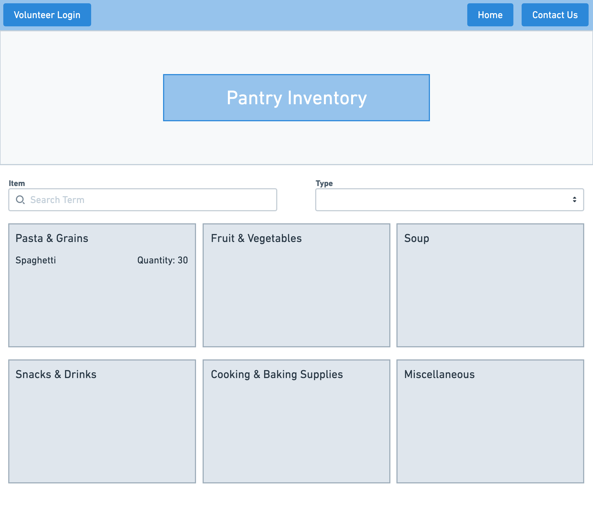
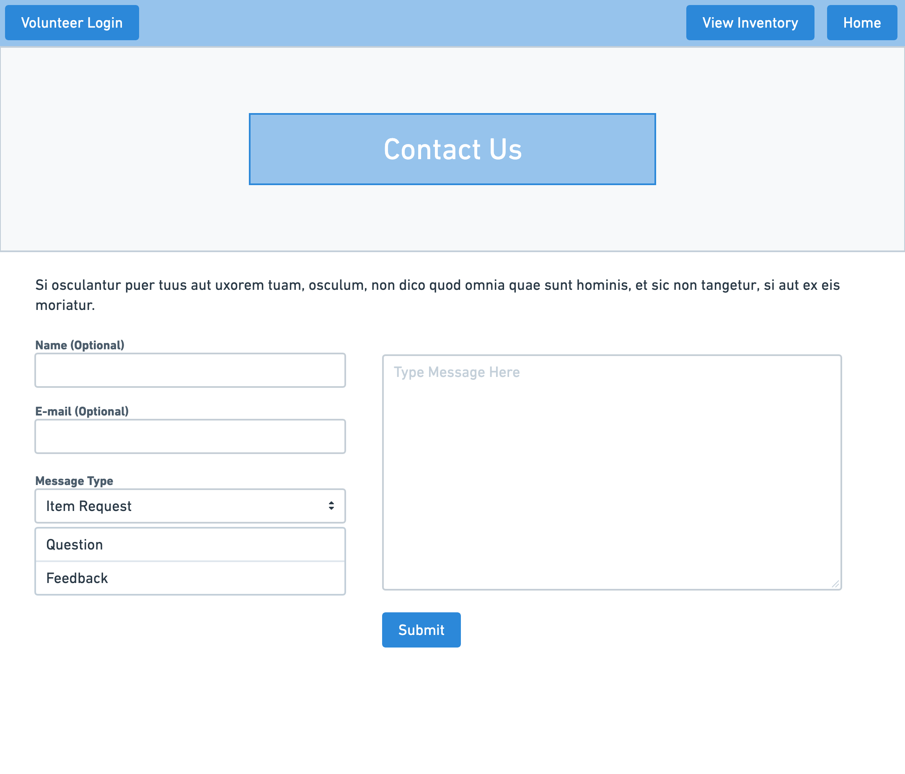
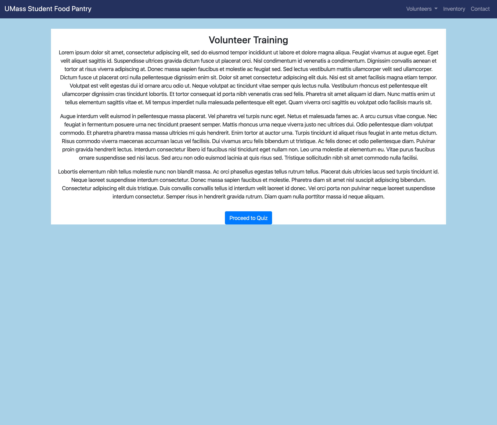
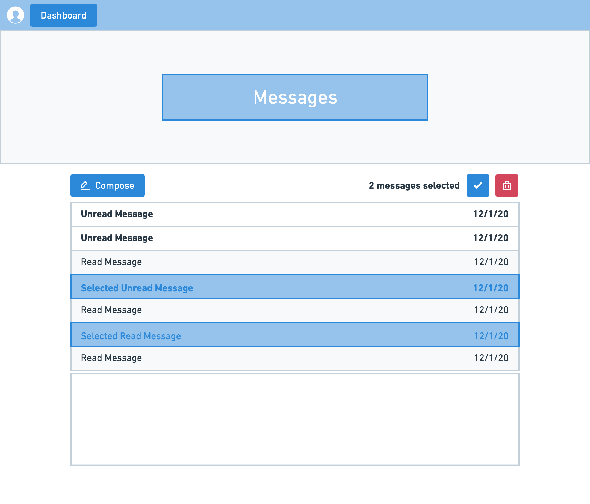
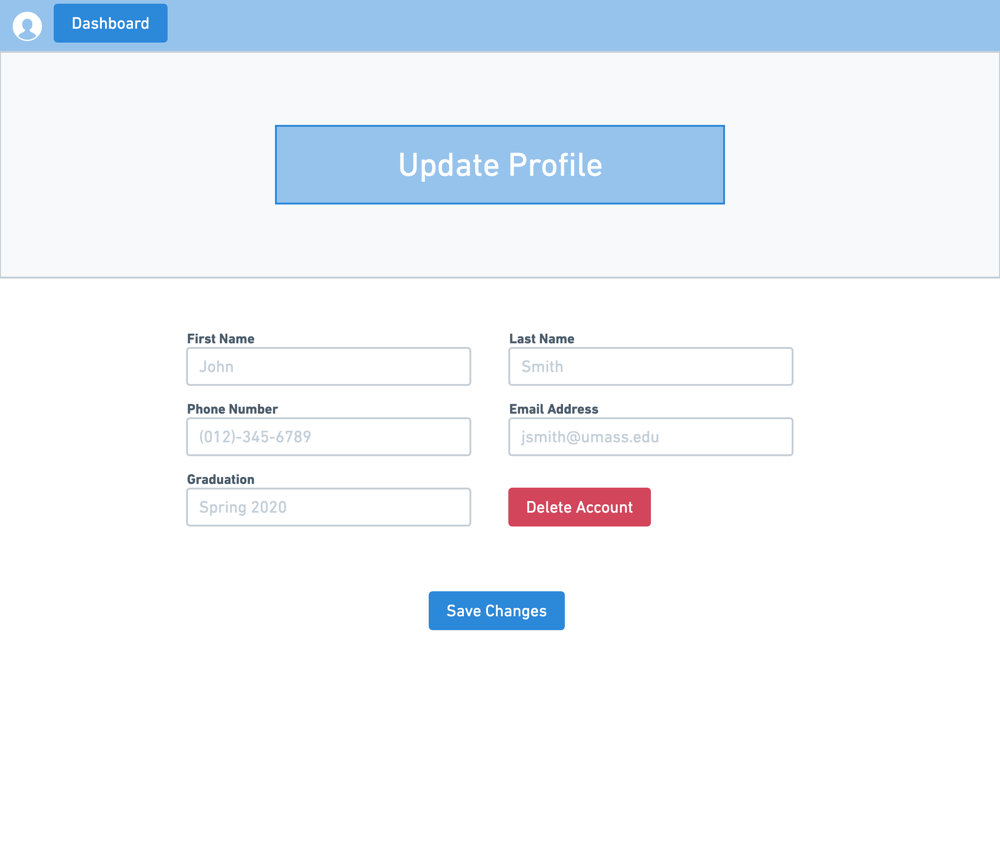
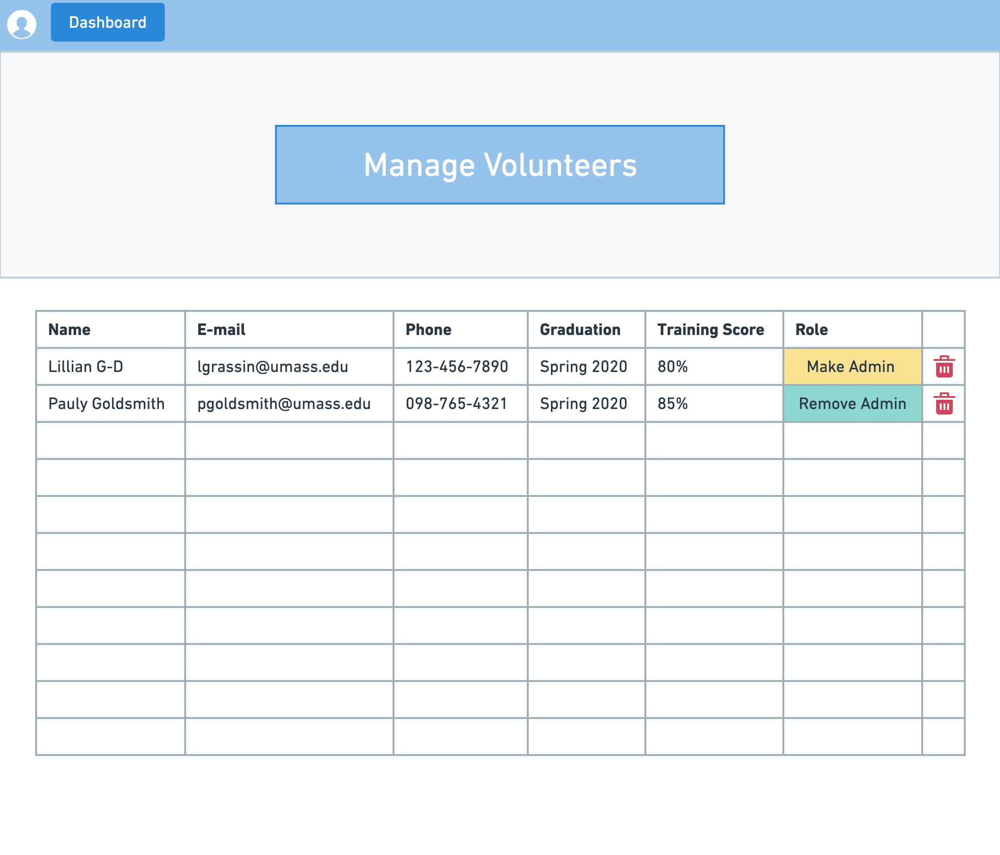

# PantryRaider

## Division of Labour

### Team Yod
- Paulaine Goldsmith ([pkg250](http://github.com/pkg250))
    - Wireframes 1-14
    - HTML pages 1-7 (public pages)
- Lillian Grassin-Drake ([lilgrassin](http://github.com/lilgrassin))
    - Wireframes 8-14
    - HTML pages 8-14 (account pages)
    - Milestone writeup
- Joanna Tang ([bpospunny](http://github.com/bpospunny))

## Innovative Idea
A management system for the UMass Student Food Pantry. Provides inventory tracking, visitor and traffic statistics, and volunteer management. Pantry stock is publicly accessible on the website and visitors can submit anonymous requests for items and feedback. Registered users (volunteers and board members) are given access to inventory management and scheduling. 

There are several existing food pantry management systems, but none are feasible for the UMass food pantry. All are paid systems that require funds the pantry does not have and are typically targeted at large scale operations. While many contain some sort of inventory tracking system, they lack the more specific features that the UMass pantry is looking for (volunteer training & scheduling, public inventory information, and community feedback).

## Important Data

### Volunteer self-service
Allows volunteers to self-register for shifts at the pantry and update inventory. New volunteers can register for an account and are required to pass a training course (reading material & quiz) before accessing any management features. Board members have elevated account privileges, such as creating/modifying shift schedules, managing volunteer accounts, and tracking statistics.

### Automated inventory tracking and statistics
Pantry inventory is stored in a database that is publicly searchable by website visitors. Registered volunteers can scan barcodes to add donations and remove outgoing items from inventory. Additionally, the database tracks statistics such as daily visitor traffic to the food pantry, average number of outgoing items per visitor, and most popular items.

### Community feedback
Anonymous community feedback is provided through an online form that allows both comments and item requests.

## Wireframes and Screenshots
| Wireframe | Screenshot |
| ------------- | ------------- |
|   |   |
|   |   |
|  |  |
|  |  |
|  |  |
|  |  |
|  |  |
|  |  |
|  |  |
|  |  |
|  |  |
|  |  |
|  |  |
|  |  |
